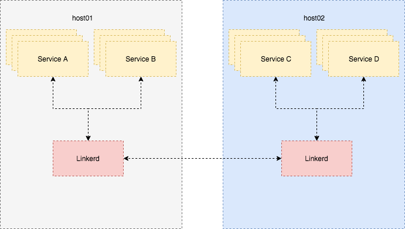

# Linkerd

## Doc Object

This doc record how to achieve microservice architecture by `linkerd`

## Why Linkerd?

Spring cloud is too heavy for me and I don't like java XD.

## Indexes

[Http Proxy](./http_proxy/README.md)
[Circuit Breaking](./circuit_breaking/README.md)

## Dtab

what's dtab?

dtab is rules for translating logical path to physical path.

reference: https://linkerd.io/advanced/dtabs/

You must handle these if you wanna use linkerd.

## Prod Architecture

The progress is in process, but it will be:

/$/inet/10.0.1.198/11081
